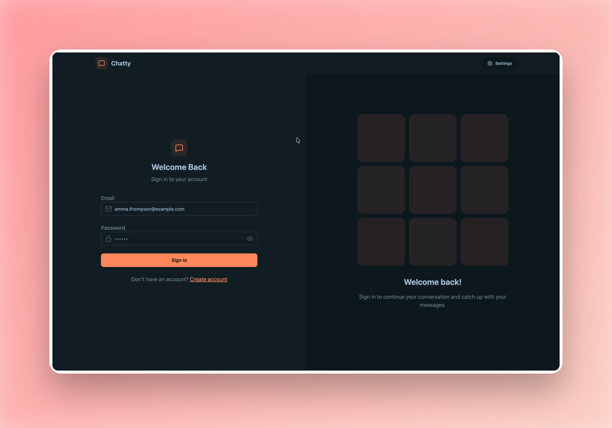
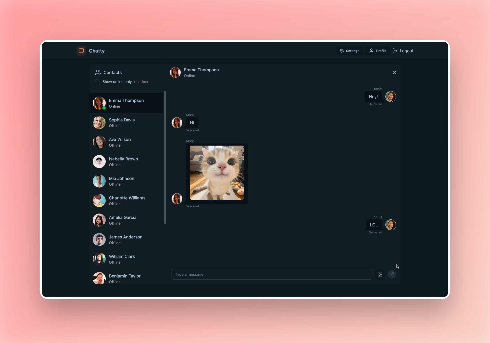
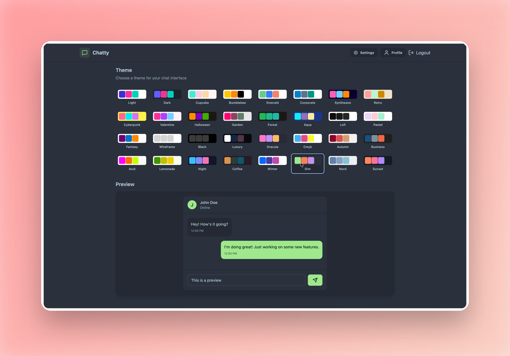

# Fullstack MERN Real-time Chat Application


A full-stack, real-time chat application built with the MERN stack (MongoDB, Express, React, Node.js) and Socket.io. This application provides a seamless communication platform with features like instantaneous messaging, online user statuses, and secure authentication.

[Live Demo](https://mern-chat-app-dro8.onrender.com) <!-- Add your live demo link here -->

## Key Features

- **Real-Time Communication**: Instant messaging powered by `Socket.io` for seamless bi-directional communication.
- **User Authentication**: Secure signup and login using JSON Web Tokens (JWT) stored in HTTP-only cookies.
- **Profile Customization**: Users can update their profile pictures using image uploads via `Cloudinary`.
- **Online Status Indicators**: Real-time tracking and broadcasting of active online users.
- **Responsive UI/UX**: A modern and completely responsive user interface built using `Tailwind CSS` and styled with `DaisyUI`.
- **Global State Management**: Performant and scalable state handling with `Zustand`.
- **RESTful API**: Well-structured backend routes with Express.js connecting the client to an integrated `MongoDB` datastore.

## Tech Stack

### Frontend
- **React.js (v19)** - Frontend library for building component-based UI.
- **Vite** - Lightning-fast frontend build tool.
- **Zustand** - Lightweight state management solution.
- **Tailwind CSS & DaisyUI** - Utility-first CSS framework and component library.
- **React Router DOM** - Application routing.
- **Axios** - HTTP client for API requests.
- **Socket.io-client** - Client-side real-time engine connection.

### Backend
- **Node.js & Express.js** - JavaScript runtime and web framework for the server.
- **MongoDB & Mongoose** - NoSQL database and ODM for data modeling.
- **Socket.io** - Server-side real-time engine configuration.
- **JSON Web Tokens (JWT)** - For secure stateless user authentication.
- **Cloudinary** - Cloud service for hosting user uploaded profile images.
- **Bcryptjs** - Password hashing utility.

## Getting Started

Follow these instructions to set up the project locally.

### Prerequisites
- Node.js (v18 or higher)
- npm or yarn
- MongoDB Atlas cluster or local MongoDB instance
- Cloudinary account

### Installation

1. **Clone the repository**
   ```bash
   git clone https://github.com/your-username/chat_app.git
   cd chat_app
   ```

2. **Install all dependencies**
   The root folder contains a script that will automatically install both client and server dependencies.
   ```bash
   npm run build
   ```
   *(Alternatively, navigate to `client/` and `server/` individually and run `npm install`)*

3. **Set up environment variables**
   Create a `.env` file in the `server` directory and configure the following variables:
   ```env
   # Backend Server Port
   PORT=5001

   # MongoDB Connection String
   MONGODB_URI=your_mongodb_cluster_connection_uri

   # JWT Secret Key
   JWT_SECRET=your_super_secret_jwt_key

   # Cloudinary Setup for Image Uploads
   CLOUDINARY_CLOUD_NAME=your_cloudinary_cloud_name
   CLOUDINARY_API_KEY=your_cloudinary_api_key
   CLOUDINARY_API_SECRET=your_cloudinary_api_secret

   # Environment
   NODE_ENV=development
   ```

### Running the Application

**Development Mode**
You can run the client and backend separately for development purposes:

1. Open a terminal and start the backend server:
   ```bash
   cd server
   npm run dev
   ```
2. Open a second terminal and start the frontend React app:
   ```bash
   cd client
   npm run dev
   ```

**Production Mode**
You can serve the entire application from the root using the built-in scripts:
```bash
# Builds the frontend and prepares dependencies
npm run build 

# Starts the production server which serves both the API and the React build
npm start 
```

## Project Structure

```text
CHAT_APP/
├── client/                 # React Frontend
│   ├── src/
│   │   ├── components/     # Reusable UI components
│   │   ├── pages/          # Application views/routes
│   │   ├── store/          # Zustand global state stores
│   │   ├── lib/            # Utilities (e.g. axios interceptors)
│   │   └── index.css       # Global application styles
│   └── package.json    
├── server/                 # Express Backend
│   ├── src/
│   │   ├── controllers/    # Request handlers logic
│   │   ├── lib/            # DB, socket handling, cloudinary configs
│   │   ├── middlewares/    # Custom Express middlewares (e.g., auth check)
│   │   ├── models/         # Mongoose User and Message schemas
│   │   ├── routes/         # API endpoint definitions
│   │   └── index.js        # Server entry point
│   └── package.json   
├── images/                 # Project screenshots
├── package.json            # Root configuration for concurrent builds
└── README.md
```

## Screenshots

| Login Page | Chat Interface | Profile Settings |
| :---: | :---: | :---: |
|  |  |  |

## Lessons Learned

Building this application cemented my understanding of advanced React patterns (utilizing `Zustand` over Redux for lightweight state management) and handling highly responsive real-time data streams utilizing WebSockets natively with Node.js. Coordinating state transitions seamlessly when users come online or upload files proved to be an excellent exercise in application architecture.

## License

This project is licensed under the MIT License - see the LICENSE file for details.
